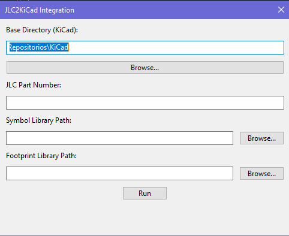

[![License][license-shield]](LICENSE)
[![Project Maintenance][maintenance-shield]][maintenance]

# Plugins
- JLC Footprints importer (JLC2KiCadPlugin.py). Plugin interface to easily import JLC footprints using TousstNicolas's python script [JLC2KiCad_lib](https://github.com/TousstNicolas/JLC2KiCad_lib):

   

When using it, just make sure:
1. Install the *JLC2KiCad_lib* as suggested on the original repo. In my case I installed it in a conda environment called KiCad. If you don't want to do it like that, ignore line 120 of *JLC2KiCadPlugin.py* and just call the right command on line 121 (`subprocess.run(["cmd.exe", "/k", command], stdin=subprocess.PIPE)`)
2. Replace line 26 of *JLC2KiCadPlugin.py* with your default *base_path*

[license-shield]: https://img.shields.io/badge/License-CC%20BY--NC--SA%204.0-lightgrey.svg?style=for-the-badge

[maintenance-shield]: https://img.shields.io/badge/maintainer-J.%20G.%20Aguado-2e48a7.svg?style=for-the-badge
[maintenance]: https://github.com/JGAguado
